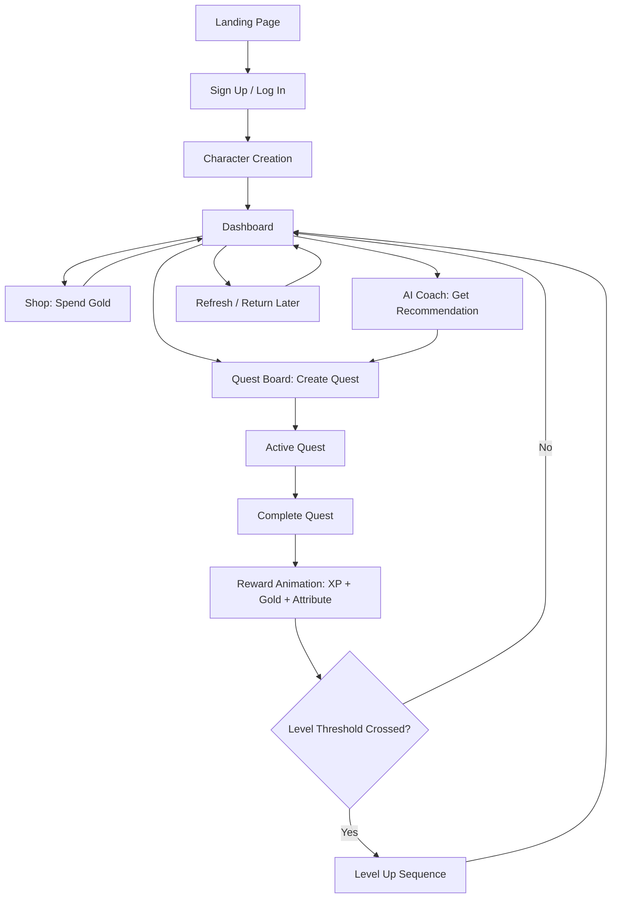
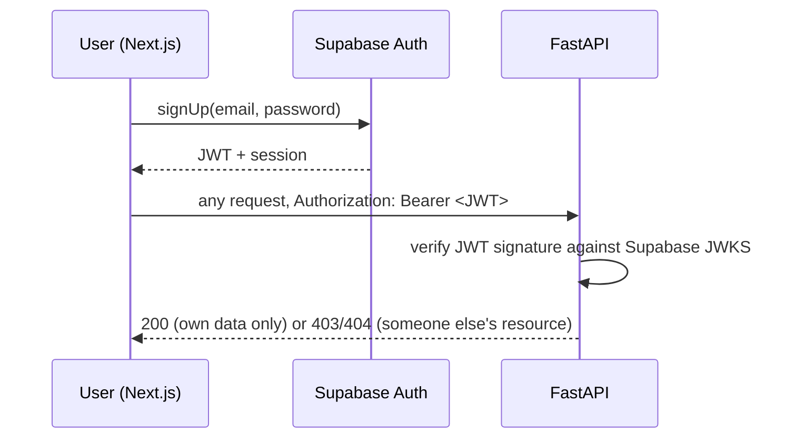
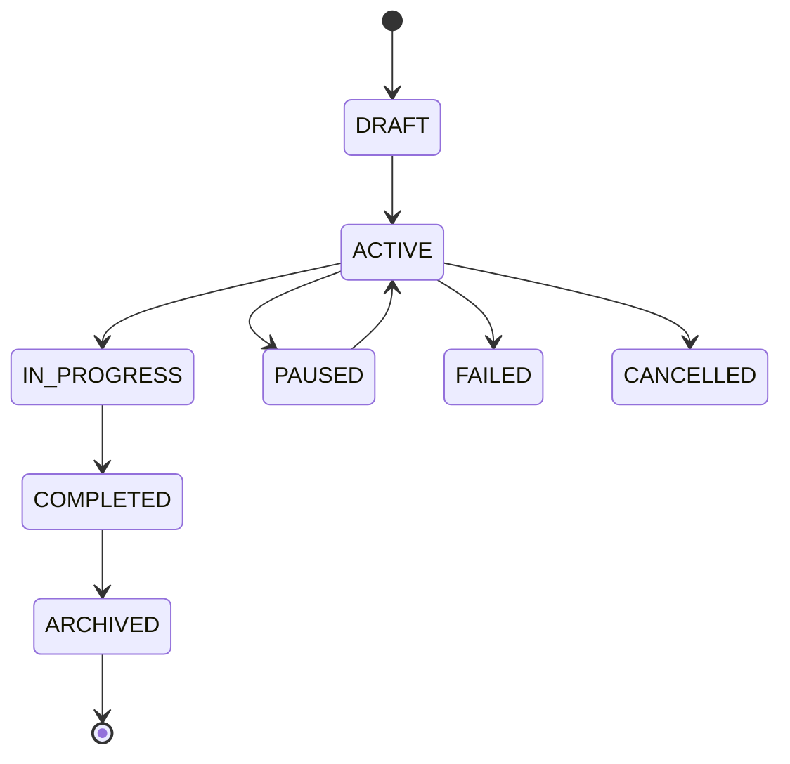
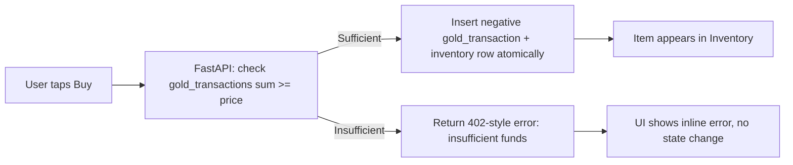
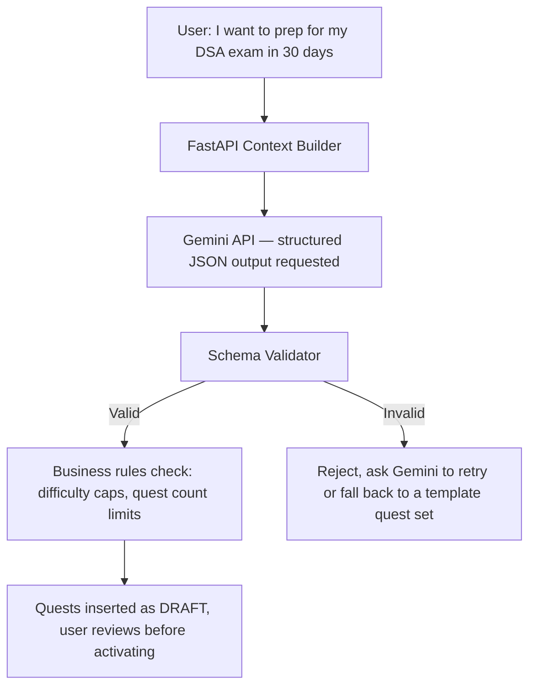

# Life RPG — App Flow Document

Phase alignment: see `0-README-Master-Index.md`.

## 1. Primary User Journey (end to end)



## 2. Screen Inventory (phase-tagged)

| Screen | Ships in Phase | Purpose |
|---|---|---|
| Landing | 6 | Pitch the concept before signup |
| Auth (signup/login) | 2 | Fast, minimal-friction entry |
| Character Creation | 2 | First emotional hook — name + starting attributes |
| Dashboard | 6 | Central hub, answers 5 questions (see UI/UX Spec §3) |
| Quest Board | 3 | Create / manage / complete quests |
| Character | 4 | Attributes, level, mastery bars, achievements |
| Progress | 4 | History, analytics over time |
| Shop | 5 | Spend Gold on cosmetics |
| Inventory | 5 | Equip purchased/earned items |
| AI Coach | 7 | Personalized recommendations |

## 3. Phase 2 — Authentication Flow


Acceptance test: a request for another user's resource ID must return 403 or 404 — never their data, and never a distinguishable "exists but not yours" vs. "doesn't exist" response (which would itself leak information).

## 4. Phase 3 — Quest Lifecycle (state machine)


Empty-title submission is rejected before it reaches this state machine at all (client-side hint + server-side hard validation).

## 5. Phase 4 — Quest Completion → Reward Flow

```mermaid
sequenceDiagram
    participant U as User
    participant N as Next.js (optimistic UI)
    participant F as FastAPI
    participant D as Supabase Postgres
    U->>N: Tap "Complete"
    N->>U: Immediately show ✓ + placeholder reward
    N->>F: POST /api/v1/quests/:id/complete
    F->>F: Verify ownership, not already completed
    F->>F: Calculate reward server-side (difficulty × modifiers)
    F->>D: Insert xp_transaction, gold_transaction, update streak, evaluate achievements
    D-->>F: Success
    F-->>N: Real reward payload (XP, Gold, attribute deltas, level-up flag)
    N->>U: Reconcile placeholder with real numbers; play level-up sequence if flagged
    Note over N,F: On network failure, N shows "⚠ Unable to save — retrying" and retries with backoff
```

## 6. Phase 5 — Shop Purchase Flow (edge case: insufficient Gold)


The frontend never decrements a locally-held Gold number to "optimistically" complete a purchase — Gold changes are confirmed-only, unlike quest-completion XP/Gold gains which use optimistic UI for the *animation* but still reconcile against the server's authoritative number.

## 7. Phase 7 — AI Quest Planner & AI Coach Flow


The AI never inserts an ACTIVE quest directly — everything it proposes lands as DRAFT, preserving user autonomy (per PRD §2, autonomy is the strongest lever gamification research supports).

## 8. Error & Edge-Case Flows

| Scenario | Required behavior |
|---|---|
| Empty quest title submitted | Client blocks submit; server independently rejects with 422 if it somehow arrives |
| Network drops mid-completion | Optimistic UI shows retry state; on reconnect, retries idempotently (same completion can't double-award) |
| Duplicate completion attempt (double-tap, replay) | Server checks `status != COMPLETED` before awarding; second attempt is a no-op, not a second reward |
| Insufficient Gold at purchase | 402-style rejection, no inventory or ledger change |
| Expired session mid-action | 401 → silent token refresh attempt → re-prompt login only if refresh fails |
| AI returns malformed JSON | Schema Validator rejects it; user sees a graceful fallback, never a raw error or a blank screen |
