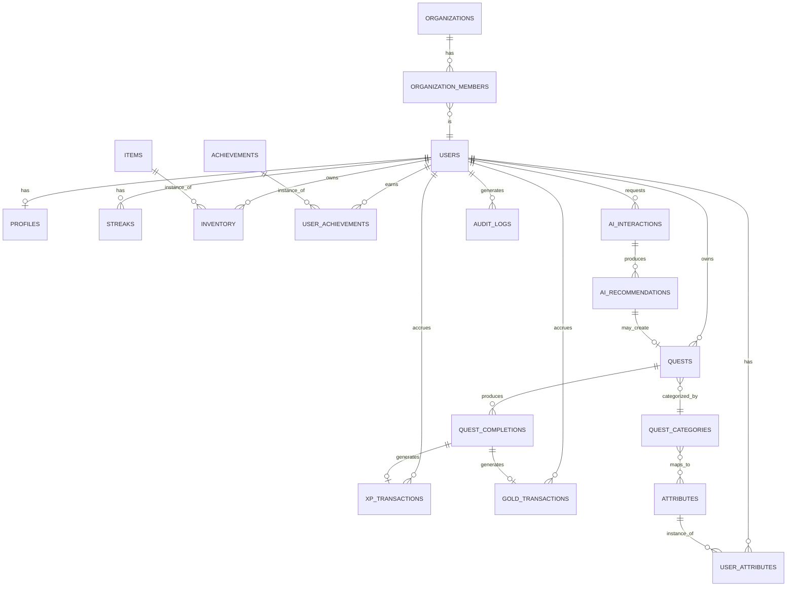

# Life RPG — Database ERD

Phase alignment: see `0-README-Master-Index.md`. Engine: **PostgreSQL** via Supabase.

## 1. Entity-Relationship Diagram



## 2. Entity Definitions by Phase Introduced

### Phase 2 — Identity
| Table | Key columns | Notes |
|---|---|---|
| `users` | `id (uuid, pk, = auth.uid())`, `email`, `created_at` | Mirrors/extends Supabase's built-in `auth.users` |
| `profiles` | `user_id (fk)`, `display_name`, `avatar_url`, `character_created_at` | One row per user |

### Phase 3 — Quest Engine
| Table | Key columns | Notes |
|---|---|---|
| `quest_categories` | `id`, `name`, `icon` | e.g. Coding, Gym, Reading |
| `quests` | `id`, `user_id (fk)`, `title`, `description`, `category_id (fk)`, `difficulty`, `status`, `deadline`, `estimated_duration`, `recurrence`, `created_at` | `status` enum matches the state machine in App Flow §4 |
| `quest_completions` | `id`, `quest_id (fk)`, `user_id (fk)`, `completed_at` | One row per completion (supports recurring quests completed many times) |

### Phase 4 — RPG Progression (ledger-based)
| Table | Key columns | Notes |
|---|---|---|
| `xp_transactions` | `id`, `user_id (fk)`, `amount`, `source` (`quest_completion` / `streak_milestone` / `achievement` / etc.), `quest_completion_id (fk, nullable)`, `created_at` | **Append-only.** Never updated or deleted. Balance = `SUM(amount)` |
| `attributes` | `id`, `name` (Intellect / Strength / Focus / Discipline / Energy), `icon` | Fixed reference table, 5 rows for the MVP |
| `user_attributes` | `user_id (fk)`, `attribute_id (fk)`, `value`, `mastery_percent` | `mastery_percent` is the UI-priority field per PRD §2 |
| `streaks` | `user_id (fk)`, `current_count`, `longest_count`, `last_active_date`, `recovery_quest_id (fk, nullable)` | A missed day sets `recovery_quest_id`, not a silent reset |

### Phase 5 — Economy
| Table | Key columns | Notes |
|---|---|---|
| `gold_transactions` | `id`, `user_id (fk)`, `amount` (signed), `source`, `created_at` | Same ledger pattern as XP; balance = `SUM(amount)` |
| `items` | `id`, `name`, `type` (frame/theme/title/effect/badge), `price_gold` | Catalog, no user reference |
| `inventory` | `id`, `user_id (fk)`, `item_id (fk)`, `equipped (bool)`, `acquired_at` | Ownership record |
| `achievements` | `id`, `name`, `description`, `trigger_rule` | e.g. "complete 100 quests" |
| `user_achievements` | `user_id (fk)`, `achievement_id (fk)`, `earned_at` | |
| `daily_missions`, `weekly_campaigns` | scoped reward containers | Optional MVP-plus scope, same ledger pattern for their payouts |

### Phase 7 — Intelligence Layer
| Table | Key columns | Notes |
|---|---|---|
| `ai_interactions` | `id`, `user_id (fk)`, `prompt_summary`, `created_at` | Logs the *sanitized* context sent, not raw user data |
| `ai_recommendations` | `id`, `ai_interaction_id (fk)`, `payload (jsonb)`, `accepted (bool, nullable)` | `accepted` feeds the "AI acceptance rate" metric from the PRD |

### Phase 8 — Cross-cutting
| Table | Key columns | Notes |
|---|---|---|
| `audit_logs` | `id`, `user_id (fk, nullable)`, `action`, `object_type`, `object_id`, `result`, `created_at` | Every BOLA-relevant check outcome, for post-hoc review |
| `notifications` | `id`, `user_id (fk)`, `type`, `payload`, `read (bool)`, `created_at` | |

### Future — Enterprise multi-tenant extension (not built in the MVP)
| Table | Key columns | Notes |
|---|---|---|
| `organizations` | `id`, `name` | |
| `organization_members` | `organization_id (fk)`, `user_id (fk)`, `role` | Personal quests remain user-private even inside an org — no default admin visibility (PRD §7) |

## 3. Row-Level Security Policy Pattern

Applied to every user-owned table (example: `quests`):

```sql
alter table quests enable row level security;

create policy "quests_select_own"
  on quests for select
  using (auth.uid() = user_id);

create policy "quests_modify_own"
  on quests for all
  using (auth.uid() = user_id)
  with check (auth.uid() = user_id);
```

This is a **second, independent layer** behind the FastAPI ownership check described in the Backend Schema Document §2 — a bug in one layer is still caught by the other.

## 4. Indexing Notes
- `quests(user_id, status)` — the dashboard's "today's quests" query filters on both.
- `xp_transactions(user_id, created_at)` and `gold_transactions(user_id, created_at)` — balance sums and history views both scan by user and time.
- `quest_completions(quest_id, completed_at)` — supports recurring-quest history and streak calculation.

## 5. Why the ledger tables, specifically
Storing `xp_transactions` and `gold_transactions` as append-only rows (rather than a `users.xp` integer column) is what makes several other requirements actually satisfiable: auditability (Backend Schema §2), anti-cheat resistance (nothing to directly overwrite), a free activity history for the Progress screen, and straightforward analytics (Gold earned vs. spent, from the PRD's success metrics) without any separate event-sourcing infrastructure.
